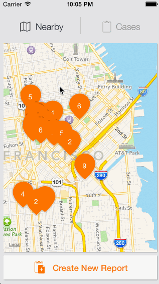
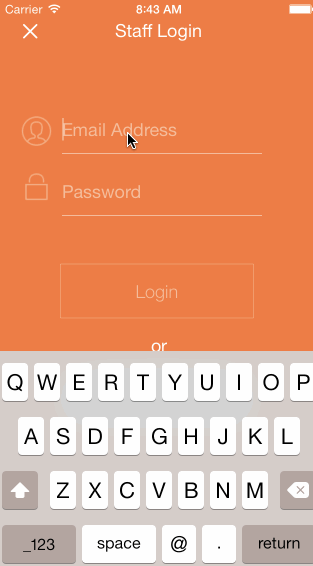
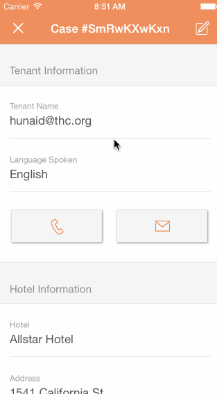

THC
===

Codepath THC

## Non-profit - Tenderloin Housing Clinic

The Tenderloin Housing Clinic helps organize Single Room Occupancy and apartment tenants to fight for quality housing in San Francisco's Tenderloin and South of Market areas. They conduct outreach, record building code violations in privately owned SRO hotels and apartments, and organize tenants to improve conditions. Tenants with habitability concerns may also drop in for housing counseling with our trained peer counselors.

## Tenderloin Housing Clinic App

The THC app aims to build awareness to poor housing conditions, enable tenants and THC staff to efficiently report violations, and provide case management to THC staff as they consolidate reports into a legal case. Below are a set of walkthroughs of the app at the time of the first demo. 

* Walkthrough no. 1 demonstrates the Explore tab where you have the SRO Hotels that the THC manages. You can quickly locate a hotel and see how many open violations are currently filed against it. 
* The second walkthrough displays our login screen for staff and then follows the creation of a new report. Fields are prepopulated based on location (SRO Hotel) and user (email, etc. where available). 
* The final walkthrough details the workflow where a staff member will review a reported case and possibly email the details back to herself. Upon taking the case 'offline' the staff member may close out the case in the management tool.

## TODO

During the time between our first demo and the official Aug. 4 Demo Day we are working to polish up each of the features in the walkthrough. Stay tuned!

### Explore tab - user is logged out

### Login and new report creation

### Case management

